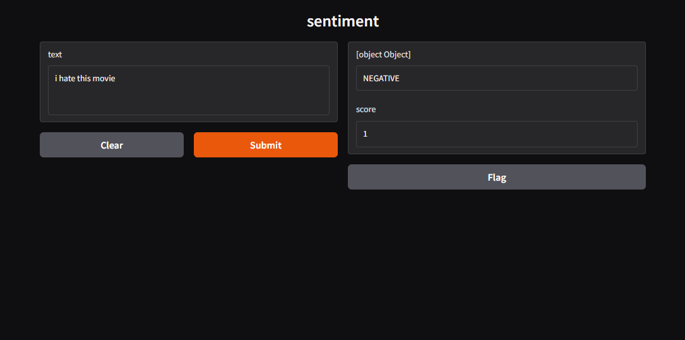

# sentiment-api


tiny gradio ui for sentiment (distilbert via transformers), docker + github actions.



this repo is mostly to show: docker packaging, actions (lint + smoke), and splitting model code from the ui.

## stack

- python + gradio + transformers
- docker
- github actions

## run local

```bash
pip install -r requirements.txt
python app.py
```

or `make run` if you have make installed.

open http://127.0.0.1:7860

## tests

```bash
pip install -r requirements-dev.txt
pytest
```

or `make test`.

no gpu / no model download — tests mock the pipeline.

## docker

```bash
docker build -t sentiment-api .
docker run -p 7860:7860 sentiment-api
```

`make docker-build` / `make docker-run` do the same.

first start downloads the model, can take a bit.

## layout

- `model.py` — lazy-loads the pipeline + `predict`
- `app.py` — gradio only
